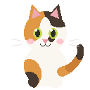
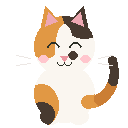

# Lottery Mania · 挂个爽

🌍 [中文](README.md) · **[English](README.en.md)**

**It's the year 9999. Your cat wants a bag of cat food. The price: $2,000,000.**



“Why is cat food so expensive?”

“Inflation. Meow.”

Welcome to **Lottery Mania**, a **2D pixel art incremental game** about washing dishes, scratching lottery tickets, and upgrading machines. Start with a sponge, turn your dishwashing earnings into tickets, and invest the proceeds in equipment. Your tabletop gets busier, the numbers climb faster, and your feline boss just wants to know when dinner will be ready.

**Your goal: hold $2,000,000 in cash and pay for the cat food.**

> This repository contains the Unity project source. Follow the instructions below to play in the editor. The game interface and onboarding tutorial are in English.

## Gameplay trailer

Every shot comes from the current version of this project running in Unity. The trailer uses actual gameplay footage, with no concept art or hand-drawn substitutes.

https://github.com/user-attachments/assets/af7ec7cf-e8f5-4e3e-b105-8ca66f10a732

> Play the video directly on this page (29 seconds · 1080p · 60fps).
> [Download the high-quality original](https://github.com/Grampusworld/Unity_Lottery/raw/main/Docs/TrailerPlan/Production/LotteryMania_29s_1080p60.mp4)

See the [trailer plan](Docs/TrailerPlan/LotteryMania_Trailer_29s.md) for the storyboard and the [production notes](Docs/TrailerPlan/Production/README.md) for recording and editing details.

## The story

## From dishwashing to funding your cat's dinner

### Your first earnings take a little scrubbing

Click **ONE MORE PLATE** in the bottom-left corner to bring a dirty plate to the table. Drag the sponge over the stains to earn your first money. When funds run low, there's always another plate to wash.

Upgrade the value of each plate, increase the number you can handle at once, or buy the purple sponge for faster cleaning. Your cat doesn't pay a salary, but at least it approves equipment purchases.

### Will the next ticket be a winner?

Buy a ticket from the **TICKETS** shop on the left. Hold the mouse button and scratch away the coating to reveal the numbers. Wins bring coins and pixel fireworks. If a ticket doesn't pay out… your sponge is still waiting where you left it.

Unlock six ticket types: **LUCKY, GOLD, NOVA, HEARTMATCH, CROSSCODE, and ZIGZAG**. They have different prices and prize pools, with rules involving number combinations, matching a center number, ascending sequences, and more. Tickets can win or lose money, and a winning ticket doesn't necessarily cover its purchase price. Keep something in reserve for the next round.

Scratch **10 / 25 / 50 tickets** of each type to earn milestones that increase your **global earnings multiplier**. Even your favorite early ticket has a reason to stay in rotation.

### Let the machines take over

Build your tabletop production line through the **GADGETS** shop:

| Equipment or upgrade | What it does |
| --- | --- |
| Automatic dishwasher | Washes plates in batches; upgrade its speed and capacity |
| Automatic ticket scratcher | Accepts tickets, scratches them in a queue, and pays out the results |
| Auto-feed | Sends newly purchased tickets straight into an unlocked scratcher, reducing manual handling |
| Sponge, plate value, and plate quantity upgrades | Improve manual earning efficiency and make starting out or rebuilding your funds easier |

Tickets, plates, and machines can all be dragged. Arrange your table, watch the machines work, and choose your next upgrade as a single sponge grows into a cat food business.

Auto-feed still requires you to buy tickets. The machines do the processing; you make the purchasing decisions.

### What happens after two million?

Reach the goal to see a completion screen showing your run's results. Return to the main menu, or keep playing to see how much more this little table can earn.



*“Good luck! Meow!”*

## Easy to start, plenty to keep your table busy

- **A cat shows you around:** NEW GAME opens a five-page tutorial with forward and back navigation. The plate button, Tickets shop, and Gadgets shop are highlighted as they're introduced. Continuing a saved game skips the tutorial.
- **Visible progress:** Equipment upgrades, shop icons, ticket milestones, and the goal bar show what each investment achieves.
- **Pixel art in motion:** Scratching, coins, fireworks, springy hover effects, and working machines are accompanied by sound effects and background music.
- **Take a break:** Press Esc to pause, or save your progress and return to the main menu. Enable Reduced Motion in settings to soften the animations.
- **Readable money totals:** Amounts retain their full digits and thousands separators. Long balances automatically use smaller text to stay within the shop panel.

## Controls

| Action | Result |
| --- | --- |
| NEW GAME | Starts a new run; asks for confirmation before overwriting existing progress |
| CONTINUE | Resumes saved progress |
| Click ONE MORE PLATE | Spawns a dirty plate |
| Drag the sponge | Cleans plates and earns money |
| Click TICKETS / GADGETS | Switches between the ticket and equipment shops |
| Hold the left mouse button and drag over a ticket's coating | Scratches the ticket |
| Hold and drag a ticket's border | Moves the ticket or feeds it into the automatic scratcher |
| Drag plates or machines | Rearranges the table |
| NEXT / PREVIOUS in the tutorial | Moves forward / back; select LET'S PLAY! on the final page to begin |
| Esc | Pauses during play; resumes when paused |

**A tip for your first run:** Wash some plates to build your starting funds, try a few ticket types, and buy equipment at your own pace. Don't put every last dollar into “just one more ticket.” Your cat can wait, and so can the next dirty plate.

## Play in Unity

1. Clone the project:

   ```bash
   git clone https://github.com/Grampusworld/Unity_Lottery.git
   ```

2. In **Unity Hub → Add project from disk**, select the project directory.
3. Open it with **Unity 6000.5.5f1** and wait for assets and packages to finish importing. The first import needs network access to the package sources.
4. Open `Assets/Scenes/SampleScene.unity` and press **Play** in the editor.
5. Choose **NEW GAME**, follow your cat's tutorial, and start with your first plate.

The repository includes the scene, prefabs, and assets. You can play without running the editor setup menus. Progress is stored locally using `PlayerPrefs`, rather than in the cloud. NEW GAME overwrites existing game progress after confirmation.

## For curious developers

### Main technologies

| Technology | Role in the project |
| --- | --- |
| Unity 6 · 6000.5.5f1 | Scenes, asset management, game runtime, and editor workflow |
| C# / MonoBehaviour | Economy, interactions, machines, menus, and onboarding |
| Universal Render Pipeline (URP) | Rendering pipeline |
| uGUI + TextMeshPro | Shops, goal bar, dialogs, and pixel font layout |
| Unity Input System | Mouse and keyboard input |
| Texture2D | Runtime scratchable coatings and some pixel effects |
| PlayerPrefs | Local persistence for balance, unlocks, upgrades, milestones, and settings |
| Unity Editor extensions | Scene setup, shop layout, and asset configuration tools |
| Python | Economy pacing models and balancing tools |

The font is **Press Start 2P**. The project also includes the Coplay Unity MCP development integration; players don't need that service to operate the game.

### Implementation details

- **Scratchable coatings:** Textures are copied at runtime and pixels are erased. The erased proportion determines when a ticket settles, leaving the source image untouched.
- **Scratching versus dragging:** The initial press position selects the interaction: scratch the coated area or drag the border.
- **Central economy configuration:** Ticket prices, unlock costs, upgrade tables, milestones, and the completion target live in `LotteryEconomy.cs`. The README avoids duplicating a full price table that could become outdated.
- **Modal onboarding and menus:** `MainMenuScreen` coordinates pausing and input blocking. `NewGameTutorial` handles pages, cat illustrations, and highlighted targets.
- **Scene transitions:** `ScreenFader` runs fades using time that isn't affected by pausing, keeping the overlay alive while New Game reloads the scene.
- **Full money amounts:** `MoneyFormat` formats currency consistently. TMP auto-sizing fits the shop's width, and insufficient-funds shake feedback preserves its size constraints.

### Project layout

```text
Assets/
  Editor/         Scene setup and layout tools
  Fonts/          Pixel font assets
  Lotteries/      Artwork for the six ticket types
  Materials/      Cat, table, sponge, and machine assets
  Prefabs/        Ticket and plate prefabs
  Resources/      Sound effects and background music
  Scenes/         SampleScene.unity
  Scripts/        Gameplay, economy, interactions, UI, and animation
Packages/         Package dependencies
ProjectSettings/  Unity project configuration
Tools/            Economy simulation, balancing, and trailer editing scripts
Docs/             Feature and design notes
```

Read more in the [onboarding notes](Docs/NewGameTutorial.md), [main menu notes](Docs/MainMenuScreen.md), [ticket rules](Docs/NewTickets.md), and [economy and transition notes](Docs/EconomyV4AndTransitions.md). These linked documents are in Chinese and include historical designs and validation records; use the current code as the reference for behavior and values. The current economy balancing tool is `Tools/solve_economy.py`; `simulate_economy.py` retains an earlier model.

## Show us your cat food bill

After playing, share your feedback in [Issues](https://github.com/Grampusworld/Unity_Lottery/issues). Which ticket makes you want to scratch another? Which upgrade takes too long? Which interaction leaves you confused? Include reproduction steps, your Unity version, and screenshots when reporting a problem.

If this cat persuades you to wash just one more plate, a Star is welcome too.

### Fonts and assets

The license for Press Start 2P is in the [SIL Open Font License](Press_Start_2P/OFL.txt). Other third-party assets are subject to their accompanying licenses. The font license doesn't grant rights to the entire project or every asset in it.
